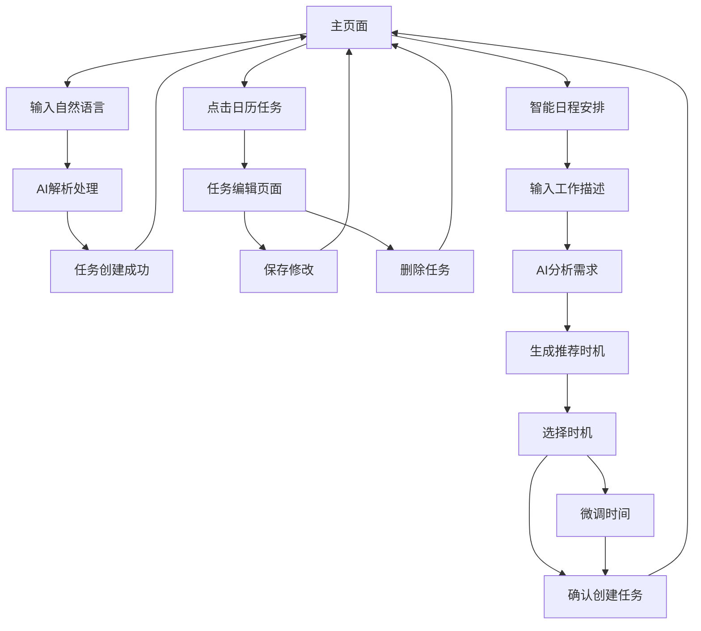

# 智能任务管理系统产品需求文档

## 1. Product Overview
智能任务管理系统是一个基于自然语言处理的MVP网页应用，用户可以通过自然语言描述创建任务，系统自动解析并在日历中展示。
- 解决用户快速创建和管理日程任务的需求，通过AI理解自然语言输入，自动提取时间、优先级等结构化信息。
- 目标用户为需要高效管理个人任务和日程的办公人员和学生群体。

## 2. Core Features

### 2.1 User Roles
| Role | Registration Method | Core Permissions |
|------|---------------------|------------------|
| 普通用户 | 邮箱注册或用户名注册 | 可创建、编辑、删除个人任务，使用AI解析功能 |
| 游客用户 | 无需注册 | 可体验基础功能，数据仅保存在本地存储中 |

### 2.2 Feature Module
我们的智能任务管理系统包含以下主要页面：
1. **登录页面**：用户登录、忘记密码、注册入口
2. **注册页面**：用户注册、邮箱验证、登录入口
3. **主页面**：任务输入区域、日历展示区域、任务列表
4. **任务编辑页面**：任务详情编辑、删除确认
5. **智能日程安排页面**：工作描述输入、AI时机推荐、时机选择确认
6. **用户设置页面**：个人信息管理、密码修改、账户设置

### 2.3 Page Details

| Page Name | Module Name | Feature description |
|-----------|-------------|---------------------|
| 登录页面 | 登录表单 | 用户名/邮箱输入、密码输入、记住我选项、表单验证 |
| 登录页面 | 登录按钮 | 提交登录请求、显示加载状态、处理登录错误 |
| 登录页面 | 辅助功能 | 忘记密码链接、注册账户链接、游客模式入口 |
| 注册页面 | 注册表单 | 用户名输入、邮箱输入、密码输入、确认密码、实时验证 |
| 注册页面 | 验证功能 | 邮箱格式验证、密码强度检查、用户名唯一性验证 |
| 注册页面 | 注册按钮 | 提交注册请求、邮箱验证发送、注册成功跳转 |
| 注册页面 | 辅助功能 | 已有账户登录链接、用户协议和隐私政策 |
| 主页面 | 用户信息栏 | 显示当前用户、退出登录、设置入口 |
| 主页面 | 自然语言输入区 | 接受用户自然语言输入，支持多行文本，实时验证输入格式 |
| 主页面 | AI解析按钮 | 触发DeepSeek-v3 API调用，显示解析进度，处理解析错误 |
| 主页面 | 日历展示区 | 使用FullCalendar展示任务，支持日视图/周视图切换，任务点击交互 |
| 主页面 | 任务列表 | 显示所有任务的列表视图，支持按时间/优先级排序，快速操作按钮 |
| 主页面 | 导航栏 | 视图切换按钮、设置选项、系统状态显示 |
| 任务编辑页面 | 任务详情表单 | 编辑任务标题、开始时间、结束时间、优先级，表单验证 |
| 任务编辑页面 | 操作按钮 | 保存修改、删除任务、取消操作，操作确认提示 |
| 智能日程安排页面 | 工作描述输入区 | 接受工作内容、截止日期、预估时长、偏好等自然语言描述 |
| 智能日程安排页面 | AI分析引擎 | 解析工作要求，分析现有日程，检测时间冲突，生成推荐时机 |
| 智能日程安排页面 | 时机推荐列表 | 显示多个可选工作时机，包含开始时间、持续时长、冲突提示 |
| 智能日程安排页面 | 时机选择确认 | 用户选择推荐时机，确认创建任务，支持微调时间 |
| 用户设置页面 | 个人信息管理 | 修改用户名、邮箱、头像上传、个人资料编辑 |
| 用户设置页面 | 密码安全 | 修改密码、安全问题设置、登录设备管理 |
| 用户设置页面 | 系统设置 | 通知偏好、主题设置、数据导出导入、账户注销 |

## 3. Core Process

**主要用户操作流程：**

**基础任务创建流程：**
1. 用户在主页面输入自然语言任务描述（如"明天上午9点开会，下午写报告"）
2. 点击解析按钮，系统调用DeepSeek-v3 API进行自然语言处理
3. 系统返回结构化任务数据（标题、时间、优先级），自动添加到日历
4. 用户可在日历中查看任务，支持日/周视图切换
5. 点击任务可进入编辑页面，修改任务详情或删除任务
6. 所有变更实时保存到本地存储

**智能日程安排流程：**
1. 用户进入智能日程安排页面，输入工作描述（如"需要完成项目报告，预计需要4小时，下周五截止，希望在上午工作"）
2. 系统AI分析工作要求：提取截止日期、预估时长、工作偏好等信息
3. 系统分析现有日程安排，检测时间冲突和空闲时段
4. 生成3-5个推荐工作时机，每个包含具体时间段、冲突提示、适合度评分
5. 用户浏览推荐时机，可查看详细信息和冲突说明
6. 用户选择合适的时机，系统自动创建对应的任务并添加到日历
7. 支持对选定时机进行微调（如调整开始时间、分割工作时段等）

## 4. User Interface Design

### 4.1 Design Style
- **主色调**：蓝色系 (#2563eb) 作为主色，白色 (#ffffff) 作为背景色
- **辅助色**：灰色 (#6b7280) 用于次要文本，绿色 (#10b981) 用于成功状态
- **按钮样式**：圆角按钮 (border-radius: 8px)，悬停效果，阴影设计
- **字体**：系统默认字体，标题使用 18-24px，正文使用 14-16px
- **布局风格**：卡片式布局，顶部导航栏，左右分栏设计
- **图标风格**：使用简洁的线性图标，支持日历、编辑、删除等常用操作

### 4.2 Page Design Overview

| Page Name | Module Name | UI Elements |
|-----------|-------------|-------------|
| 主页面 | 自然语言输入区 | 大型文本框，占据页面左侧1/3，圆角边框，placeholder提示文本 |
| 主页面 | AI解析按钮 | 蓝色主色调按钮，loading动画，位于输入框下方 |
| 主页面 | 日历展示区 | 占据页面右侧2/3，白色背景，任务以彩色块显示，悬停效果 |
| 主页面 | 任务列表 | 位于输入区下方，卡片式任务项，优先级颜色标识 |
| 任务编辑页面 | 任务详情表单 | 居中模态框，表单字段垂直排列，清晰的标签和输入框 |
| 任务编辑页面 | 操作按钮 | 底部水平排列，主要操作使用主色调，危险操作使用红色 |
| 智能日程安排页面 | 工作描述输入区 | 大型多行文本框，支持富文本提示，占据页面上部1/3 |
| 智能日程安排页面 | AI分析按钮 | 渐变蓝色按钮，智能图标，loading动画效果 |
| 智能日程安排页面 | 时机推荐卡片 | 卡片式布局，显示时间段、适合度评分、冲突提示，悬停放大效果 |
| 智能日程安排页面 | 选择确认区 | 底部固定区域，显示选中时机详情，确认和微调按钮 |

### 4.3 Responsiveness
系统采用桌面优先设计，同时支持移动端适配。在移动设备上，左右分栏布局改为上下堆叠，日历组件自动适应屏幕宽度，支持触摸操作和手势交互。