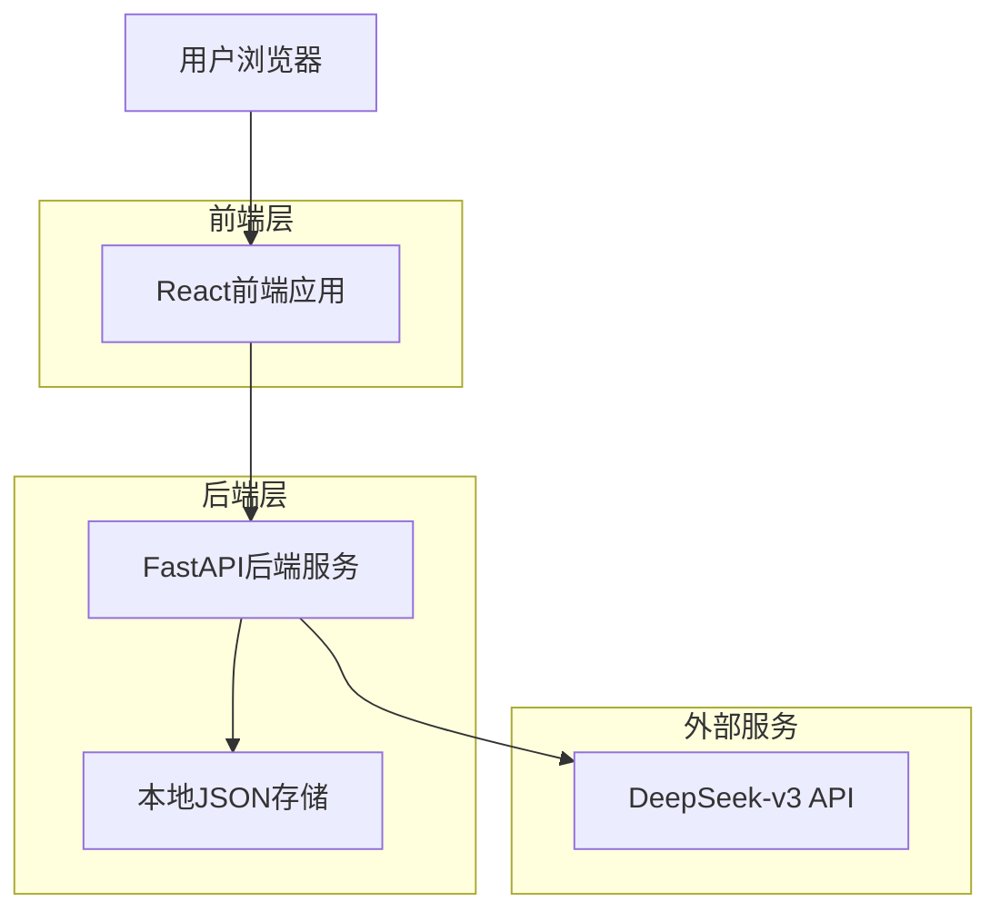
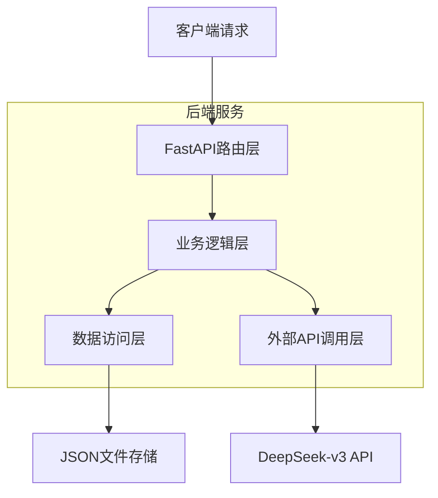
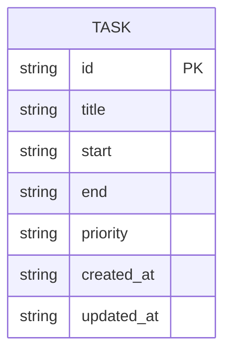

# 智能任务管理系统技术架构文档

## 1. Architecture design



## 2. Technology Description

- Frontend: React@18 + TypeScript + Vite + TailwindCSS + FullCalendar
- Backend: FastAPI + Python 3.9+ + Pydantic + httpx
- Storage: 本地JSON文件存储
- External API: DeepSeek-v3 API

## 3. Route definitions

| Route | Purpose |
|-------|---------|
| / | 主页面，包含任务输入和日历展示 |
| /edit/:taskId | 任务编辑页面（模态框形式） |

## 4. API definitions

### 4.1 Core API

**任务解析接口**
```
POST /api/tasks/parse
```

Request:
| Param Name | Param Type | isRequired | Description |
|------------|------------|------------|-------------|
| text | string | true | 用户输入的自然语言任务描述 |

Response:
| Param Name | Param Type | Description |
|------------|------------|-------------|
| success | boolean | 解析是否成功 |
| tasks | Task[] | 解析出的任务列表 |
| error | string | 错误信息（可选） |

Example Request:
```json
{
  "text": "明天上午9点开会，下午写报告"
}
```

Example Response:
```json
{
  "success": true,
  "tasks": [
    {
      "id": "task_1",
      "title": "开会",
      "start": "2024-01-15T09:00:00",
      "end": "2024-01-15T10:00:00",
      "priority": "high"
    },
    {
      "id": "task_2",
      "title": "写报告",
      "start": "2024-01-15T14:00:00",
      "end": "2024-01-15T17:00:00",
      "priority": "medium"
    }
  ]
}
```

**获取所有任务**
```
GET /api/tasks
```

Response:
| Param Name | Param Type | Description |
|------------|------------|-------------|
| tasks | Task[] | 所有任务列表 |

**更新任务**
```
PUT /api/tasks/{task_id}
```

Request:
| Param Name | Param Type | isRequired | Description |
|------------|------------|------------|-------------|
| title | string | true | 任务标题 |
| start | string | true | 开始时间（ISO格式） |
| end | string | false | 结束时间（ISO格式） |
| priority | string | false | 优先级（low/medium/high） |

**删除任务**
```
DELETE /api/tasks/{task_id}
```

Response:
| Param Name | Param Type | Description |
|------------|------------|-------------|
| success | boolean | 删除是否成功 |

## 5. Server architecture diagram



## 6. Data model

### 6.1 Data model definition



### 6.2 Data Definition Language

**Task数据结构（JSON Schema）**
```json
{
  "type": "object",
  "properties": {
    "id": {
      "type": "string",
      "description": "任务唯一标识符"
    },
    "title": {
      "type": "string",
      "description": "任务标题"
    },
    "start": {
      "type": "string",
      "format": "date-time",
      "description": "开始时间（ISO 8601格式）"
    },
    "end": {
      "type": "string",
      "format": "date-time",
      "description": "结束时间（ISO 8601格式，可选）"
    },
    "priority": {
      "type": "string",
      "enum": ["low", "medium", "high"],
      "description": "任务优先级"
    },
    "created_at": {
      "type": "string",
      "format": "date-time",
      "description": "创建时间"
    },
    "updated_at": {
      "type": "string",
      "format": "date-time",
      "description": "更新时间"
    }
  },
  "required": ["id", "title", "start"]
}
```

**本地存储文件结构（tasks.json）**
```json
{
  "tasks": [
    {
      "id": "task_1",
      "title": "开会",
      "start": "2024-01-15T09:00:00",
      "end": "2024-01-15T10:00:00",
      "priority": "high",
      "created_at": "2024-01-14T10:30:00",
      "updated_at": "2024-01-14T10:30:00"
    }
  ],
  "metadata": {
    "version": "1.0",
    "last_updated": "2024-01-14T10:30:00"
  }
}
```

**DeepSeek-v3 API调用配置**
```python
# API配置
DEEPSEEK_API_URL = "https://api.deepseek.com/v1/chat/completions"
DEEPSEEK_MODEL = "deepseek-chat"

# 提示词模板
SYSTEM_PROMPT = """
你是一个任务解析助手。请将用户的自然语言描述解析为结构化的任务数据。
返回JSON格式，包含以下字段：
- title: 任务标题
- start: 开始时间（ISO 8601格式）
- end: 结束时间（可选，ISO 8601格式）
- priority: 优先级（low/medium/high）

如果用户描述包含多个任务，请返回任务数组。
"""
```