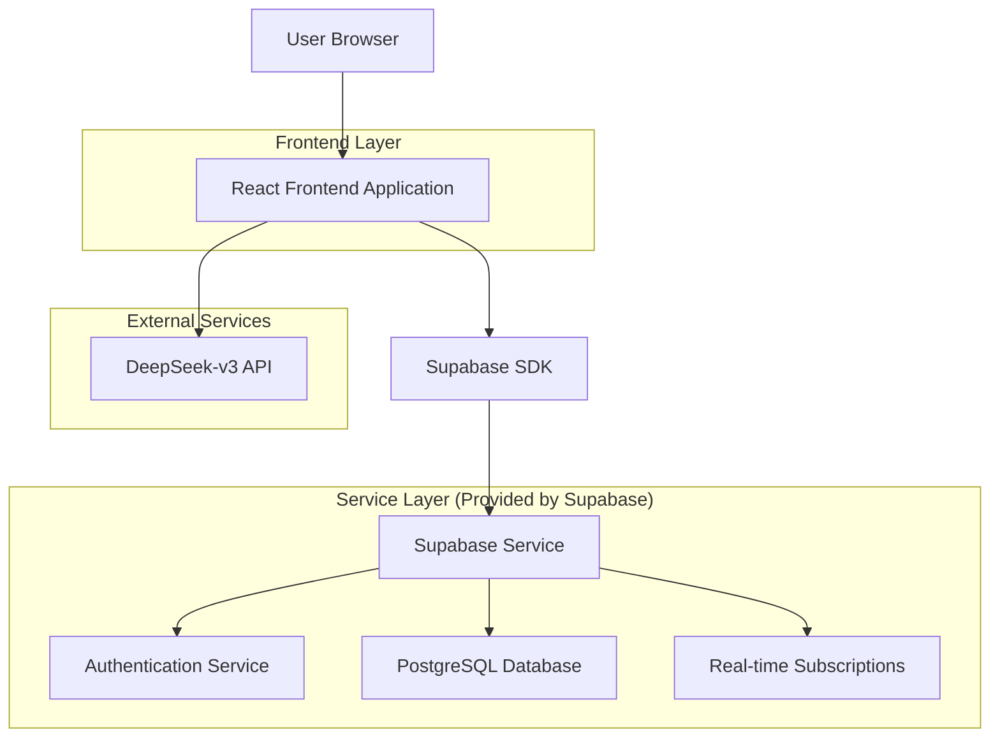
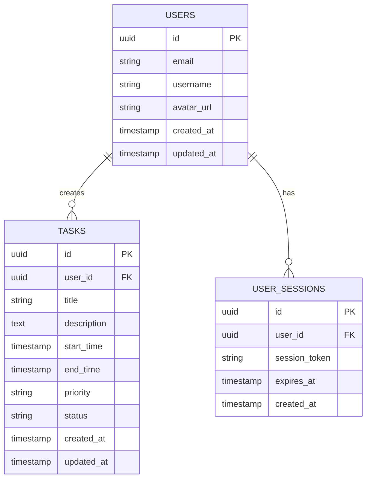

# 智能任务管理系统技术架构文档

## 1. Architecture design



## 2. Technology Description

- Frontend: React@18 + TypeScript + Tailwind CSS@3 + Vite
- Backend: Supabase (Authentication + Database + Real-time)
- External API: DeepSeek-v3 (自然语言处理)
- State Management: React Context + useState/useEffect
- UI Components: 自定义组件 + Headless UI
- Calendar: FullCalendar React组件

## 3. Route definitions

| Route | Purpose |
|-------|----------|
| / | 重定向到登录页面或主页面（根据认证状态） |
| /login | 用户登录页面 |
| /register | 用户注册页面 |
| /forgot-password | 忘记密码页面 |
| /reset-password | 重置密码页面 |
| /dashboard | 主页面，任务管理和日历展示 |
| /schedule | 智能日程安排页面 |
| /settings | 用户设置页面 |
| /settings/profile | 个人信息管理 |
| /settings/security | 密码和安全设置 |
| /guest | 游客模式主页面 |

## 4. API definitions

### 4.1 Authentication API (Supabase)

用户注册
```
supabase.auth.signUp({
  email: string,
  password: string,
  options: {
    data: {
      username: string
    }
  }
})
```

用户登录
```
supabase.auth.signInWithPassword({
  email: string,
  password: string
})
```

密码重置
```
supabase.auth.resetPasswordForEmail(email: string)
```

### 4.2 Tasks API (Supabase)

获取用户任务
```
supabase
  .from('tasks')
  .select('*')
  .eq('user_id', userId)
```

创建任务
```
supabase
  .from('tasks')
  .insert({
    user_id: string,
    title: string,
    start_time: string,
    end_time: string,
    priority: string,
    description?: string
  })
```

### 4.3 External API

DeepSeek-v3 自然语言处理
```
POST https://api.deepseek.com/v1/chat/completions
```

Request:
| Param Name | Param Type | isRequired | Description |
|------------|------------|------------|-------------|
| model | string | true | deepseek-chat |
| messages | array | true | 对话消息数组 |
| temperature | number | false | 生成随机性控制 |

Response:
| Param Name | Param Type | Description |
|------------|------------|-------------|
| choices | array | AI生成的回复选项 |
| usage | object | API使用统计 |

## 5. Data model

### 5.1 Data model definition



### 5.2 Data Definition Language

用户表 (users)
```sql
-- Supabase自动创建auth.users表，我们创建public.profiles表存储扩展信息
CREATE TABLE public.profiles (
  id UUID REFERENCES auth.users(id) PRIMARY KEY,
  username VARCHAR(50) UNIQUE NOT NULL,
  avatar_url TEXT,
  created_at TIMESTAMP WITH TIME ZONE DEFAULT NOW(),
  updated_at TIMESTAMP WITH TIME ZONE DEFAULT NOW()
);

-- 创建索引
CREATE INDEX idx_profiles_username ON public.profiles(username);

-- 启用RLS (Row Level Security)
ALTER TABLE public.profiles ENABLE ROW LEVEL SECURITY;

-- 创建RLS策略
CREATE POLICY "Users can view own profile" ON public.profiles
  FOR SELECT USING (auth.uid() = id);

CREATE POLICY "Users can update own profile" ON public.profiles
  FOR UPDATE USING (auth.uid() = id);

CREATE POLICY "Users can insert own profile" ON public.profiles
  FOR INSERT WITH CHECK (auth.uid() = id);

-- 权限设置
GRANT SELECT ON public.profiles TO anon;
GRANT ALL PRIVILEGES ON public.profiles TO authenticated;
```

任务表 (tasks)
```sql
CREATE TABLE public.tasks (
  id UUID PRIMARY KEY DEFAULT gen_random_uuid(),
  user_id UUID REFERENCES auth.users(id) ON DELETE CASCADE,
  title VARCHAR(255) NOT NULL,
  description TEXT,
  start_time TIMESTAMP WITH TIME ZONE NOT NULL,
  end_time TIMESTAMP WITH TIME ZONE,
  priority VARCHAR(20) DEFAULT 'medium' CHECK (priority IN ('low', 'medium', 'high')),
  status VARCHAR(20) DEFAULT 'pending' CHECK (status IN ('pending', 'completed', 'cancelled')),
  created_at TIMESTAMP WITH TIME ZONE DEFAULT NOW(),
  updated_at TIMESTAMP WITH TIME ZONE DEFAULT NOW()
);

-- 创建索引
CREATE INDEX idx_tasks_user_id ON public.tasks(user_id);
CREATE INDEX idx_tasks_start_time ON public.tasks(start_time);
CREATE INDEX idx_tasks_priority ON public.tasks(priority);
CREATE INDEX idx_tasks_status ON public.tasks(status);

-- 启用RLS
ALTER TABLE public.tasks ENABLE ROW LEVEL SECURITY;

-- 创建RLS策略
CREATE POLICY "Users can view own tasks" ON public.tasks
  FOR SELECT USING (auth.uid() = user_id);

CREATE POLICY "Users can insert own tasks" ON public.tasks
  FOR INSERT WITH CHECK (auth.uid() = user_id);

CREATE POLICY "Users can update own tasks" ON public.tasks
  FOR UPDATE USING (auth.uid() = user_id);

CREATE POLICY "Users can delete own tasks" ON public.tasks
  FOR DELETE USING (auth.uid() = user_id);

-- 权限设置
GRANT SELECT ON public.tasks TO anon;
GRANT ALL PRIVILEGES ON public.tasks TO authenticated;
```

触发器函数 (自动更新时间戳)
```sql
-- 创建更新时间戳的函数
CREATE OR REPLACE FUNCTION update_updated_at_column()
RETURNS TRIGGER AS $$
BEGIN
  NEW.updated_at = NOW();
  RETURN NEW;
END;
$$ language 'plpgsql';

-- 为profiles表创建触发器
CREATE TRIGGER update_profiles_updated_at
  BEFORE UPDATE ON public.profiles
  FOR EACH ROW
  EXECUTE FUNCTION update_updated_at_column();

-- 为tasks表创建触发器
CREATE TRIGGER update_tasks_updated_at
  BEFORE UPDATE ON public.tasks
  FOR EACH ROW
  EXECUTE FUNCTION update_updated_at_column();
```

初始化数据
```sql
-- 创建用户注册时自动创建profile的函数
CREATE OR REPLACE FUNCTION public.handle_new_user()
RETURNS TRIGGER AS $$
BEGIN
  INSERT INTO public.profiles (id, username)
  VALUES (NEW.id, COALESCE(NEW.raw_user_meta_data->>'username', 'user_' || substr(NEW.id::text, 1, 8)));
  RETURN NEW;
END;
$$ LANGUAGE plpgsql SECURITY DEFINER;

-- 创建触发器，在用户注册时自动创建profile
CREATE TRIGGER on_auth_user_created
  AFTER INSERT ON auth.users
  FOR EACH ROW EXECUTE FUNCTION public.handle_new_user();
```
