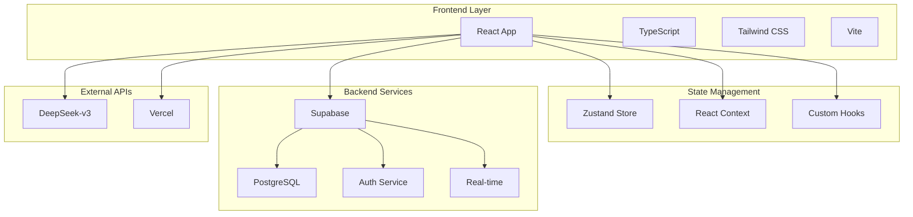
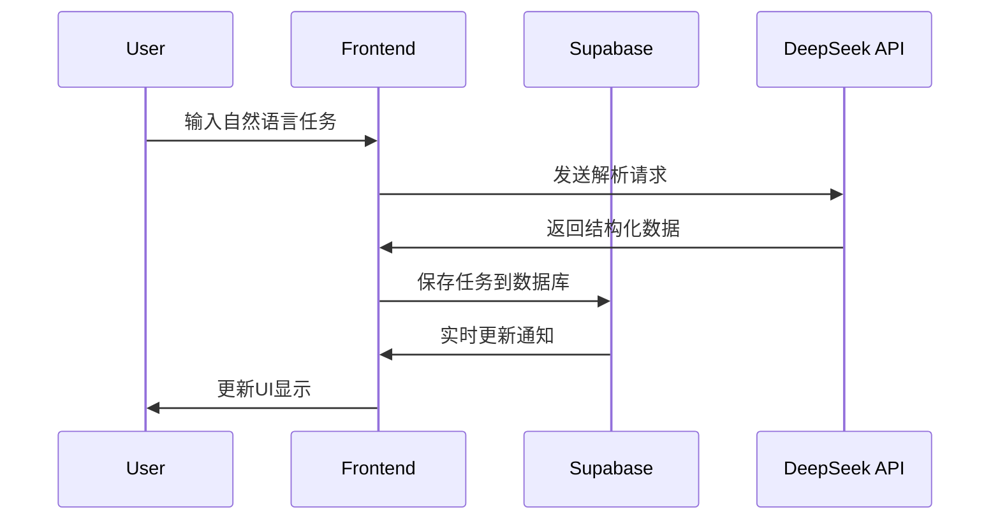

# SmartTime 开发者指南

<div align="center">
  
  
  <p><strong>SmartTime 项目完整开发指南</strong></p>
</div>

## 📋 目录

- [项目概述](#项目概述)
- [技术架构](#技术架构)
- [开发环境搭建](#开发环境搭建)
- [项目结构详解](#项目结构详解)
- [核心功能实现](#核心功能实现)
- [API 文档](#api-文档)
- [数据库设计](#数据库设计)
- [状态管理](#状态管理)
- [组件开发规范](#组件开发规范)
- [测试指南](#测试指南)
- [性能优化](#性能优化)
- [部署流程](#部署流程)
- [故障排除](#故障排除)
- [贡献指南](#贡献指南)

## 🎯 项目概述

SmartTime 是一个现代化的全栈 Web 应用，采用 React + TypeScript + Supabase 技术栈构建。项目的核心目标是通过 AI 技术简化任务管理流程，让用户能够通过自然语言快速创建和管理任务。

### 核心特性

- **前端**: React 18 + TypeScript + Vite + Tailwind CSS
- **后端**: Supabase (PostgreSQL + 实时订阅 + 认证)
- **AI 集成**: DeepSeek-v3 API 自然语言处理
- **状态管理**: Zustand + React Context
- **UI 组件**: 自定义组件 + Radix UI + FullCalendar
- **部署**: Vercel + 自动化 CI/CD

## 🏗️ 技术架构

### 整体架构图



### 数据流架构



## 🛠️ 开发环境搭建

### 系统要求

- **Node.js**: 18.0+ (推荐使用 LTS 版本)
- **包管理器**: npm 9.0+ 或 yarn 1.22+
- **Git**: 2.30+
- **编辑器**: VS Code (推荐) + 相关插件

### 推荐的 VS Code 插件

```json
{
  "recommendations": [
    "bradlc.vscode-tailwindcss",
    "esbenp.prettier-vscode",
    "dbaeumer.vscode-eslint",
    "ms-vscode.vscode-typescript-next",
    "formulahendry.auto-rename-tag",
    "christian-kohler.path-intellisense",
    "ms-vscode.vscode-json",
    "bradlc.vscode-tailwindcss"
  ]
}
```

### 环境配置步骤

1. **克隆仓库**
   ```bash
   git clone https://github.com/your-username/smarttime.git
   cd smarttime
   ```

2. **安装依赖**
   ```bash
   npm install
   ```

3. **配置环境变量**
   ```bash
   cp .env.example .env
   ```
   
   编辑 `.env` 文件：
   ```env
   # Supabase 配置
   VITE_SUPABASE_URL=your_supabase_project_url
   VITE_SUPABASE_ANON_KEY=your_supabase_anon_key
   
   # DeepSeek API 配置
   VITE_DEEPSEEK_API_KEY=your_deepseek_api_key
   
   # 开发环境配置
   VITE_APP_ENV=development
   VITE_API_BASE_URL=http://localhost:5173
   ```

4. **启动开发服务器**
   ```bash
   npm run dev
   ```

5. **验证安装**
   
   访问 `http://localhost:5173` 确认应用正常运行

## 📁 项目结构详解

```
smartime/
├── public/                     # 静态资源
│   ├── favicon.svg            # 网站图标
│   └── robots.txt             # 搜索引擎配置
├── src/
│   ├── components/            # 可复用组件
│   │   ├── ui/               # 基础 UI 组件
│   │   │   ├── Button.tsx    # 按钮组件
│   │   │   ├── Input.tsx     # 输入框组件
│   │   │   ├── Modal.tsx     # 模态框组件
│   │   │   └── index.ts      # 组件导出
│   │   ├── Calendar/         # 日历相关组件
│   │   │   ├── CalendarView.tsx
│   │   │   ├── TaskEvent.tsx
│   │   │   └── index.ts
│   │   ├── TaskForm/         # 任务表单组件
│   │   │   ├── TaskForm.tsx
│   │   │   ├── TaskInput.tsx
│   │   │   └── index.ts
│   │   └── Layout/           # 布局组件
│   │       ├── Header.tsx
│   │       ├── Sidebar.tsx
│   │       └── Layout.tsx
│   ├── pages/                # 页面组件
│   │   ├── Login.tsx         # 登录页面
│   │   ├── Register.tsx      # 注册页面
│   │   ├── Dashboard.tsx     # 主页面
│   │   ├── Schedule.tsx      # 智能日程页面
│   │   ├── Settings.tsx      # 设置页面
│   │   └── NotFound.tsx      # 404页面
│   ├── contexts/             # React Context
│   │   ├── AuthContext.tsx   # 认证上下文
│   │   ├── TaskContext.tsx   # 任务上下文
│   │   └── ThemeContext.tsx  # 主题上下文
│   ├── hooks/                # 自定义 Hooks
│   │   ├── useAuth.ts        # 认证相关
│   │   ├── useTasks.ts       # 任务管理
│   │   ├── useLocalStorage.ts # 本地存储
│   │   └── useDebounce.ts    # 防抖处理
│   ├── store/                # Zustand 状态管理
│   │   ├── authStore.ts      # 认证状态
│   │   ├── taskStore.ts      # 任务状态
│   │   └── uiStore.ts        # UI 状态
│   ├── utils/                # 工具函数
│   │   ├── api.ts            # API 调用
│   │   ├── helpers.ts        # 辅助函数
│   │   ├── constants.ts      # 常量定义
│   │   ├── validation.ts     # 表单验证
│   │   └── dateUtils.ts      # 日期处理
│   ├── types/                # TypeScript 类型定义
│   │   ├── auth.ts           # 认证相关类型
│   │   ├── task.ts           # 任务相关类型
│   │   ├── api.ts            # API 响应类型
│   │   └── index.ts          # 类型导出
│   ├── lib/                  # 第三方库配置
│   │   ├── supabase.ts       # Supabase 客户端
│   │   ├── deepseek.ts       # DeepSeek API 配置
│   │   └── calendar.ts       # FullCalendar 配置
│   ├── styles/               # 样式文件
│   │   ├── globals.css       # 全局样式
│   │   └── components.css    # 组件样式
│   ├── App.tsx               # 根组件
│   ├── main.tsx              # 应用入口
│   ├── index.css             # 主样式文件
│   └── vite-env.d.ts         # Vite 类型声明
├── supabase/                 # 数据库相关
│   ├── migrations/           # 数据库迁移文件
│   │   ├── 001_initial_schema.sql
│   │   └── 002_add_tasks_table.sql
│   └── seed.sql              # 初始数据
├── tests/                    # 测试文件
│   ├── __mocks__/           # Mock 文件
│   ├── components/          # 组件测试
│   ├── pages/               # 页面测试
│   ├── utils/               # 工具函数测试
│   └── setup.ts             # 测试配置
├── docs/                     # 项目文档
│   ├── api.md               # API 文档
│   ├── deployment.md        # 部署文档
│   └── contributing.md      # 贡献指南
├── .env.example             # 环境变量模板
├── .env.local               # 本地环境变量
├── .gitignore               # Git 忽略文件
├── .eslintrc.json           # ESLint 配置
├── .prettierrc              # Prettier 配置
├── package.json             # 项目依赖
├── tsconfig.json            # TypeScript 配置
├── tailwind.config.js       # Tailwind 配置
├── vite.config.ts           # Vite 配置
├── vitest.config.ts         # Vitest 配置
└── README.md                # 项目说明
```

## 🔧 核心功能实现

### 1. 用户认证系统

#### AuthContext 实现

```typescript
// src/contexts/AuthContext.tsx
import { createContext, useContext, useEffect, useState } from 'react'
import { User, Session } from '@supabase/supabase-js'
import { supabase } from '../lib/supabase'

interface AuthContextType {
  user: User | null
  session: Session | null
  loading: boolean
  signIn: (email: string, password: string) => Promise<void>
  signUp: (email: string, password: string, username: string) => Promise<void>
  signOut: () => Promise<void>
  resetPassword: (email: string) => Promise<void>
}

const AuthContext = createContext<AuthContextType | undefined>(undefined)

export const useAuth = () => {
  const context = useContext(AuthContext)
  if (!context) {
    throw new Error('useAuth must be used within an AuthProvider')
  }
  return context
}

export const AuthProvider: React.FC<{ children: React.ReactNode }> = ({ children }) => {
  const [user, setUser] = useState<User | null>(null)
  const [session, setSession] = useState<Session | null>(null)
  const [loading, setLoading] = useState(true)

  useEffect(() => {
    // 获取初始会话
    supabase.auth.getSession().then(({ data: { session } }) => {
      setSession(session)
      setUser(session?.user ?? null)
      setLoading(false)
    })

    // 监听认证状态变化
    const { data: { subscription } } = supabase.auth.onAuthStateChange(
      async (event, session) => {
        setSession(session)
        setUser(session?.user ?? null)
        setLoading(false)
      }
    )

    return () => subscription.unsubscribe()
  }, [])

  const signIn = async (email: string, password: string) => {
    const { error } = await supabase.auth.signInWithPassword({ email, password })
    if (error) throw error
  }

  const signUp = async (email: string, password: string, username: string) => {
    const { error } = await supabase.auth.signUp({
      email,
      password,
      options: {
        data: { username }
      }
    })
    if (error) throw error
  }

  const signOut = async () => {
    const { error } = await supabase.auth.signOut()
    if (error) throw error
  }

  const resetPassword = async (email: string) => {
    const { error } = await supabase.auth.resetPasswordForEmail(email)
    if (error) throw error
  }

  const value = {
    user,
    session,
    loading,
    signIn,
    signUp,
    signOut,
    resetPassword
  }

  return <AuthContext.Provider value={value}>{children}</AuthContext.Provider>
}
```

### 2. 任务管理系统

#### Task Store (Zustand)

```typescript
// src/store/taskStore.ts
import { create } from 'zustand'
import { Task, CreateTaskData, UpdateTaskData } from '../types/task'
import { supabase } from '../lib/supabase'

interface TaskStore {
  tasks: Task[]
  loading: boolean
  error: string | null
  
  // Actions
  fetchTasks: () => Promise<void>
  createTask: (data: CreateTaskData) => Promise<void>
  updateTask: (id: string, data: UpdateTaskData) => Promise<void>
  deleteTask: (id: string) => Promise<void>
  parseNaturalLanguage: (input: string) => Promise<Task[]>
}

export const useTaskStore = create<TaskStore>((set, get) => ({
  tasks: [],
  loading: false,
  error: null,

  fetchTasks: async () => {
    set({ loading: true, error: null })
    try {
      const { data, error } = await supabase
        .from('tasks')
        .select('*')
        .order('created_at', { ascending: false })
      
      if (error) throw error
      set({ tasks: data || [], loading: false })
    } catch (error) {
      set({ error: error.message, loading: false })
    }
  },

  createTask: async (data: CreateTaskData) => {
    set({ loading: true, error: null })
    try {
      const { data: newTask, error } = await supabase
        .from('tasks')
        .insert([data])
        .select()
        .single()
      
      if (error) throw error
      
      const { tasks } = get()
      set({ tasks: [newTask, ...tasks], loading: false })
    } catch (error) {
      set({ error: error.message, loading: false })
    }
  },

  updateTask: async (id: string, data: UpdateTaskData) => {
    set({ loading: true, error: null })
    try {
      const { data: updatedTask, error } = await supabase
        .from('tasks')
        .update(data)
        .eq('id', id)
        .select()
        .single()
      
      if (error) throw error
      
      const { tasks } = get()
      const updatedTasks = tasks.map(task => 
        task.id === id ? updatedTask : task
      )
      set({ tasks: updatedTasks, loading: false })
    } catch (error) {
      set({ error: error.message, loading: false })
    }
  },

  deleteTask: async (id: string) => {
    set({ loading: true, error: null })
    try {
      const { error } = await supabase
        .from('tasks')
        .delete()
        .eq('id', id)
      
      if (error) throw error
      
      const { tasks } = get()
      const filteredTasks = tasks.filter(task => task.id !== id)
      set({ tasks: filteredTasks, loading: false })
    } catch (error) {
      set({ error: error.message, loading: false })
    }
  },

  parseNaturalLanguage: async (input: string) => {
    set({ loading: true, error: null })
    try {
      const response = await fetch('/api/parse-tasks', {
        method: 'POST',
        headers: {
          'Content-Type': 'application/json',
        },
        body: JSON.stringify({ input })
      })
      
      if (!response.ok) throw new Error('解析失败')
      
      const { tasks } = await response.json()
      set({ loading: false })
      return tasks
    } catch (error) {
      set({ error: error.message, loading: false })
      return []
    }
  }
}))
```

### 3. AI 自然语言处理

#### DeepSeek API 集成

```typescript
// src/lib/deepseek.ts
interface DeepSeekMessage {
  role: 'system' | 'user' | 'assistant'
  content: string
}

interface DeepSeekResponse {
  choices: {
    message: {
      content: string
    }
  }[]
}

class DeepSeekAPI {
  private apiKey: string
  private baseURL = 'https://api.deepseek.com/v1'

  constructor(apiKey: string) {
    this.apiKey = apiKey
  }

  async parseTasksFromText(input: string): Promise<any[]> {
    const systemPrompt = `
你是一个智能任务解析助手。请将用户的自然语言输入解析为结构化的任务数据。

输出格式要求：
- 返回 JSON 数组
- 每个任务包含：title, start_time, end_time, priority, description
- 时间格式：ISO 8601 (YYYY-MM-DDTHH:mm:ss)
- 优先级：high, medium, low

示例输入："明天上午9点开会，下午2点写报告"
示例输出：
[
  {
    "title": "开会",
    "start_time": "2024-01-15T09:00:00",
    "end_time": "2024-01-15T10:00:00",
    "priority": "medium",
    "description": "会议安排"
  },
  {
    "title": "写报告",
    "start_time": "2024-01-15T14:00:00",
    "end_time": "2024-01-15T16:00:00",
    "priority": "medium",
    "description": "报告撰写"
  }
]
`

    const messages: DeepSeekMessage[] = [
      { role: 'system', content: systemPrompt },
      { role: 'user', content: input }
    ]

    try {
      const response = await fetch(`${this.baseURL}/chat/completions`, {
        method: 'POST',
        headers: {
          'Content-Type': 'application/json',
          'Authorization': `Bearer ${this.apiKey}`
        },
        body: JSON.stringify({
          model: 'deepseek-chat',
          messages,
          temperature: 0.1,
          max_tokens: 2000
        })
      })

      if (!response.ok) {
        throw new Error(`API 请求失败: ${response.status}`)
      }

      const data: DeepSeekResponse = await response.json()
      const content = data.choices[0]?.message?.content
      
      if (!content) {
        throw new Error('API 返回内容为空')
      }

      // 解析 JSON 响应
      const tasks = JSON.parse(content)
      return Array.isArray(tasks) ? tasks : [tasks]
    } catch (error) {
      console.error('DeepSeek API 错误:', error)
      throw new Error('任务解析失败，请重试')
    }
  }
}

export const deepseekAPI = new DeepSeekAPI(
  import.meta.env.VITE_DEEPSEEK_API_KEY || ''
)
```

## 📊 API 文档

### Supabase API 接口

#### 认证接口

| 方法 | 端点 | 描述 | 参数 |
|------|------|------|------|
| POST | `/auth/signup` | 用户注册 | `{ email, password, username }` |
| POST | `/auth/signin` | 用户登录 | `{ email, password }` |
| POST | `/auth/signout` | 用户登出 | - |
| POST | `/auth/reset` | 重置密码 | `{ email }` |

#### 任务管理接口

| 方法 | 端点 | 描述 | 参数 |
|------|------|------|------|
| GET | `/tasks` | 获取任务列表 | `?user_id=uuid` |
| POST | `/tasks` | 创建任务 | `{ title, start_time, end_time, priority, description }` |
| PUT | `/tasks/:id` | 更新任务 | `{ title?, start_time?, end_time?, priority?, description? }` |
| DELETE | `/tasks/:id` | 删除任务 | - |

### 自定义 API 接口

#### AI 解析接口

```typescript
// POST /api/parse-tasks
{
  "input": "明天上午9点开会，下午写报告"
}

// Response
{
  "success": true,
  "tasks": [
    {
      "title": "开会",
      "start_time": "2024-01-15T09:00:00",
      "end_time": "2024-01-15T10:00:00",
      "priority": "medium",
      "description": "会议安排"
    }
  ]
}
```

## 🗄️ 数据库设计

### 数据表结构

#### users 表 (Supabase Auth)

```sql
-- Supabase 自动管理的用户表
CREATE TABLE auth.users (
  id UUID PRIMARY KEY DEFAULT gen_random_uuid(),
  email VARCHAR(255) UNIQUE NOT NULL,
  encrypted_password VARCHAR(255),
  email_confirmed_at TIMESTAMPTZ,
  created_at TIMESTAMPTZ DEFAULT NOW(),
  updated_at TIMESTAMPTZ DEFAULT NOW()
);
```

#### profiles 表

```sql
-- 用户扩展信息表
CREATE TABLE public.profiles (
  id UUID REFERENCES auth.users(id) PRIMARY KEY,
  username VARCHAR(50) UNIQUE NOT NULL,
  full_name VARCHAR(100),
  avatar_url TEXT,
  bio TEXT,
  preferences JSONB DEFAULT '{}',
  created_at TIMESTAMPTZ DEFAULT NOW(),
  updated_at TIMESTAMPTZ DEFAULT NOW()
);

-- 创建索引
CREATE INDEX idx_profiles_username ON public.profiles(username);
CREATE INDEX idx_profiles_created_at ON public.profiles(created_at);

-- 启用 RLS
ALTER TABLE public.profiles ENABLE ROW LEVEL SECURITY;

-- RLS 策略
CREATE POLICY "Users can view own profile" ON public.profiles
  FOR SELECT USING (auth.uid() = id);

CREATE POLICY "Users can update own profile" ON public.profiles
  FOR UPDATE USING (auth.uid() = id);
```

#### tasks 表

```sql
-- 任务表
CREATE TABLE public.tasks (
  id UUID PRIMARY KEY DEFAULT gen_random_uuid(),
  user_id UUID REFERENCES auth.users(id) ON DELETE CASCADE,
  title VARCHAR(200) NOT NULL,
  description TEXT,
  start_time TIMESTAMPTZ NOT NULL,
  end_time TIMESTAMPTZ NOT NULL,
  priority VARCHAR(20) DEFAULT 'medium' CHECK (priority IN ('low', 'medium', 'high')),
  status VARCHAR(20) DEFAULT 'pending' CHECK (status IN ('pending', 'in_progress', 'completed', 'cancelled')),
  tags TEXT[] DEFAULT '{}',
  metadata JSONB DEFAULT '{}',
  created_at TIMESTAMPTZ DEFAULT NOW(),
  updated_at TIMESTAMPTZ DEFAULT NOW()
);

-- 创建索引
CREATE INDEX idx_tasks_user_id ON public.tasks(user_id);
CREATE INDEX idx_tasks_start_time ON public.tasks(start_time);
CREATE INDEX idx_tasks_priority ON public.tasks(priority);
CREATE INDEX idx_tasks_status ON public.tasks(status);
CREATE INDEX idx_tasks_created_at ON public.tasks(created_at);

-- 启用 RLS
ALTER TABLE public.tasks ENABLE ROW LEVEL SECURITY;

-- RLS 策略
CREATE POLICY "Users can view own tasks" ON public.tasks
  FOR SELECT USING (auth.uid() = user_id);

CREATE POLICY "Users can insert own tasks" ON public.tasks
  FOR INSERT WITH CHECK (auth.uid() = user_id);

CREATE POLICY "Users can update own tasks" ON public.tasks
  FOR UPDATE USING (auth.uid() = user_id);

CREATE POLICY "Users can delete own tasks" ON public.tasks
  FOR DELETE USING (auth.uid() = user_id);
```

#### task_categories 表

```sql
-- 任务分类表
CREATE TABLE public.task_categories (
  id UUID PRIMARY KEY DEFAULT gen_random_uuid(),
  user_id UUID REFERENCES auth.users(id) ON DELETE CASCADE,
  name VARCHAR(50) NOT NULL,
  color VARCHAR(7) DEFAULT '#3B82F6', -- 十六进制颜色
  description TEXT,
  created_at TIMESTAMPTZ DEFAULT NOW(),
  updated_at TIMESTAMPTZ DEFAULT NOW(),
  UNIQUE(user_id, name)
);

-- 创建索引
CREATE INDEX idx_task_categories_user_id ON public.task_categories(user_id);

-- 启用 RLS
ALTER TABLE public.task_categories ENABLE ROW LEVEL SECURITY;

-- RLS 策略
CREATE POLICY "Users can manage own categories" ON public.task_categories
  FOR ALL USING (auth.uid() = user_id);
```

### 数据库函数

```sql
-- 更新 updated_at 字段的触发器函数
CREATE OR REPLACE FUNCTION update_updated_at_column()
RETURNS TRIGGER AS $$
BEGIN
  NEW.updated_at = NOW();
  RETURN NEW;
END;
$$ language 'plpgsql';

-- 为相关表创建触发器
CREATE TRIGGER update_profiles_updated_at
  BEFORE UPDATE ON public.profiles
  FOR EACH ROW EXECUTE FUNCTION update_updated_at_column();

CREATE TRIGGER update_tasks_updated_at
  BEFORE UPDATE ON public.tasks
  FOR EACH ROW EXECUTE FUNCTION update_updated_at_column();

CREATE TRIGGER update_task_categories_updated_at
  BEFORE UPDATE ON public.task_categories
  FOR EACH ROW EXECUTE FUNCTION update_updated_at_column();
```

## 🎨 组件开发规范

### 组件结构规范

```typescript
// src/components/ui/Button.tsx
import React from 'react'
import { cn } from '../../utils/helpers'

interface ButtonProps extends React.ButtonHTMLAttributes<HTMLButtonElement> {
  variant?: 'primary' | 'secondary' | 'outline' | 'ghost'
  size?: 'sm' | 'md' | 'lg'
  loading?: boolean
  children: React.ReactNode
}

export const Button: React.FC<ButtonProps> = ({
  variant = 'primary',
  size = 'md',
  loading = false,
  className,
  children,
  disabled,
  ...props
}) => {
  const baseClasses = 'inline-flex items-center justify-center rounded-md font-medium transition-colors focus-visible:outline-none focus-visible:ring-2 focus-visible:ring-ring focus-visible:ring-offset-2 disabled:opacity-50 disabled:pointer-events-none'
  
  const variants = {
    primary: 'bg-primary text-primary-foreground hover:bg-primary/90',
    secondary: 'bg-secondary text-secondary-foreground hover:bg-secondary/80',
    outline: 'border border-input hover:bg-accent hover:text-accent-foreground',
    ghost: 'hover:bg-accent hover:text-accent-foreground'
  }
  
  const sizes = {
    sm: 'h-9 px-3 text-sm',
    md: 'h-10 py-2 px-4',
    lg: 'h-11 px-8'
  }

  return (
    <button
      className={cn(
        baseClasses,
        variants[variant],
        sizes[size],
        className
      )}
      disabled={disabled || loading}
      {...props}
    >
      {loading && (
        <svg className="mr-2 h-4 w-4 animate-spin" viewBox="0 0 24 24">
          <circle
            className="opacity-25"
            cx="12"
            cy="12"
            r="10"
            stroke="currentColor"
            strokeWidth="4"
          />
          <path
            className="opacity-75"
            fill="currentColor"
            d="m4 12a8 8 0 018-8V0C5.373 0 0 5.373 0 12h4zm2 5.291A7.962 7.962 0 014 12H0c0 3.042 1.135 5.824 3 7.938l3-2.647z"
          />
        </svg>
      )}
      {children}
    </button>
  )
}
```

### 组件测试规范

```typescript
// src/components/ui/__tests__/Button.test.tsx
import { render, screen, fireEvent } from '@testing-library/react'
import { Button } from '../Button'

describe('Button Component', () => {
  it('renders correctly', () => {
    render(<Button>Click me</Button>)
    expect(screen.getByRole('button')).toBeInTheDocument()
    expect(screen.getByText('Click me')).toBeInTheDocument()
  })

  it('handles click events', () => {
    const handleClick = jest.fn()
    render(<Button onClick={handleClick}>Click me</Button>)
    
    fireEvent.click(screen.getByRole('button'))
    expect(handleClick).toHaveBeenCalledTimes(1)
  })

  it('shows loading state', () => {
    render(<Button loading>Loading</Button>)
    expect(screen.getByRole('button')).toBeDisabled()
    expect(screen.getByText('Loading')).toBeInTheDocument()
  })

  it('applies correct variant classes', () => {
    render(<Button variant="secondary">Secondary</Button>)
    const button = screen.getByRole('button')
    expect(button).toHaveClass('bg-secondary')
  })
})
```

## 🧪 测试指南

### 测试配置

```typescript
// vitest.config.ts
import { defineConfig } from 'vitest/config'
import react from '@vitejs/plugin-react'
import path from 'path'

export default defineConfig({
  plugins: [react()],
  test: {
    globals: true,
    environment: 'jsdom',
    setupFiles: ['./src/tests/setup.ts'],
    css: true
  },
  resolve: {
    alias: {
      '@': path.resolve(__dirname, './src')
    }
  }
})
```

```typescript
// src/tests/setup.ts
import '@testing-library/jest-dom'
import { vi } from 'vitest'

// Mock Supabase
vi.mock('../lib/supabase', () => ({
  supabase: {
    auth: {
      getSession: vi.fn(),
      onAuthStateChange: vi.fn(),
      signInWithPassword: vi.fn(),
      signUp: vi.fn(),
      signOut: vi.fn(),
      resetPasswordForEmail: vi.fn()
    },
    from: vi.fn(() => ({
      select: vi.fn().mockReturnThis(),
      insert: vi.fn().mockReturnThis(),
      update: vi.fn().mockReturnThis(),
      delete: vi.fn().mockReturnThis(),
      eq: vi.fn().mockReturnThis(),
      order: vi.fn().mockReturnThis(),
      single: vi.fn()
    }))
  }
}))

// Mock environment variables
Object.defineProperty(window, 'import', {
  value: {
    meta: {
      env: {
        VITE_SUPABASE_URL: 'http://localhost:54321',
        VITE_SUPABASE_ANON_KEY: 'test-key',
        VITE_DEEPSEEK_API_KEY: 'test-deepseek-key'
      }
    }
  }
})
```

### 测试脚本

```json
{
  "scripts": {
    "test": "vitest",
    "test:ui": "vitest --ui",
    "test:run": "vitest run",
    "test:coverage": "vitest run --coverage",
    "test:watch": "vitest --watch"
  }
}
```

## ⚡ 性能优化

### 1. 代码分割

```typescript
// src/App.tsx
import { lazy, Suspense } from 'react'
import { BrowserRouter as Router, Routes, Route } from 'react-router-dom'
import { LoadingSpinner } from './components/ui/LoadingSpinner'

// 懒加载页面组件
const Dashboard = lazy(() => import('./pages/Dashboard'))
const Schedule = lazy(() => import('./pages/Schedule'))
const Settings = lazy(() => import('./pages/Settings'))

function App() {
  return (
    <Router>
      <Suspense fallback={<LoadingSpinner />}>
        <Routes>
          <Route path="/dashboard" element={<Dashboard />} />
          <Route path="/schedule" element={<Schedule />} />
          <Route path="/settings" element={<Settings />} />
        </Routes>
      </Suspense>
    </Router>
  )
}
```

### 2. 图片优化

```typescript
// src/components/ui/OptimizedImage.tsx
import { useState } from 'react'

interface OptimizedImageProps {
  src: string
  alt: string
  width?: number
  height?: number
  className?: string
}

export const OptimizedImage: React.FC<OptimizedImageProps> = ({
  src,
  alt,
  width,
  height,
  className
}) => {
  const [loading, setLoading] = useState(true)
  const [error, setError] = useState(false)

  return (
    <div className={`relative ${className}`}>
      {loading && (
        <div className="absolute inset-0 bg-gray-200 animate-pulse rounded" />
      )}
       setLoading(false)}
        onError={() => {
          setLoading(false)
          setError(true)
        }}
        className={`transition-opacity duration-300 ${
          loading ? 'opacity-0' : 'opacity-100'
        }`}
      />
      {error && (
        <div className="absolute inset-0 bg-gray-100 flex items-center justify-center">
          <span className="text-gray-500">加载失败</span>
        </div>
      )}
    </div>
  )
}
```

### 3. 缓存策略

```typescript
// src/hooks/useCache.ts
import { useState, useEffect } from 'react'

interface CacheOptions {
  key: string
  ttl?: number // 缓存时间（毫秒）
}

export function useCache<T>(options: CacheOptions) {
  const { key, ttl = 5 * 60 * 1000 } = options // 默认5分钟
  const [data, setData] = useState<T | null>(null)
  const [loading, setLoading] = useState(false)

  const get = (): T | null => {
    try {
      const cached = localStorage.getItem(key)
      if (!cached) return null

      const { data, timestamp } = JSON.parse(cached)
      if (Date.now() - timestamp > ttl) {
        localStorage.removeItem(key)
        return null
      }

      return data
    } catch {
      return null
    }
  }

  const set = (value: T) => {
    try {
      const cacheData = {
        data: value,
        timestamp: Date.now()
      }
      localStorage.setItem(key, JSON.stringify(cacheData))
      setData(value)
    } catch (error) {
      console.warn('缓存设置失败:', error)
    }
  }

  const clear = () => {
    localStorage.removeItem(key)
    setData(null)
  }

  useEffect(() => {
    const cached = get()
    if (cached) {
      setData(cached)
    }
  }, [key])

  return { data, set, clear, get }
}
```

## 🚀 部署流程

### Vercel 部署配置

```json
// vercel.json
{
  "buildCommand": "npm run build",
  "outputDirectory": "dist",
  "devCommand": "npm run dev",
  "installCommand": "npm install",
  "framework": "vite",
  "rewrites": [
    {
      "source": "/api/(.*)",
      "destination": "/api/$1"
    },
    {
      "source": "/(.*)",
      "destination": "/index.html"
    }
  ],
  "headers": [
    {
      "source": "/api/(.*)",
      "headers": [
        {
          "key": "Access-Control-Allow-Origin",
          "value": "*"
        },
        {
          "key": "Access-Control-Allow-Methods",
          "value": "GET, POST, PUT, DELETE, OPTIONS"
        },
        {
          "key": "Access-Control-Allow-Headers",
          "value": "Content-Type, Authorization"
        }
      ]
    }
  ]
}
```

### GitHub Actions CI/CD

```yaml
# .github/workflows/deploy.yml
name: Deploy to Vercel

on:
  push:
    branches: [main]
  pull_request:
    branches: [main]

jobs:
  test:
    runs-on: ubuntu-latest
    steps:
      - uses: actions/checkout@v3
      - uses: actions/setup-node@v3
        with:
          node-version: '18'
          cache: 'npm'
      
      - run: npm ci
      - run: npm run lint
      - run: npm run test:run
      - run: npm run build

  deploy:
    needs: test
    runs-on: ubuntu-latest
    if: github.ref == 'refs/heads/main'
    steps:
      - uses: actions/checkout@v3
      - uses: amondnet/vercel-action@v20
        with:
          vercel-token: ${{ secrets.VERCEL_TOKEN }}
          vercel-org-id: ${{ secrets.ORG_ID }}
          vercel-project-id: ${{ secrets.PROJECT_ID }}
          vercel-args: '--prod'
```

## 🔧 故障排除

### 常见问题及解决方案

#### 1. Supabase 连接问题

**问题**: 无法连接到 Supabase

**解决方案**:
```bash
# 检查环境变量
echo $VITE_SUPABASE_URL
echo $VITE_SUPABASE_ANON_KEY

# 验证 Supabase 配置
npm run test:connection
```

#### 2. 构建失败

**问题**: TypeScript 类型错误

**解决方案**:
```bash
# 检查类型错误
npm run check

# 更新类型定义
npm install @types/node@latest
```

#### 3. 性能问题

**问题**: 页面加载缓慢

**解决方案**:
```bash
# 分析包大小
npm run build -- --analyze

# 检查网络请求
# 使用浏览器开发者工具的 Network 面板
```

### 调试工具

```typescript
// src/utils/debug.ts
export const debug = {
  log: (message: string, data?: any) => {
    if (import.meta.env.DEV) {
      console.log(`[DEBUG] ${message}`, data)
    }
  },
  
  error: (message: string, error?: any) => {
    if (import.meta.env.DEV) {
      console.error(`[ERROR] ${message}`, error)
    }
  },
  
  performance: (label: string, fn: () => void) => {
    if (import.meta.env.DEV) {
      console.time(label)
      fn()
      console.timeEnd(label)
    } else {
      fn()
    }
  }
}
```

## 🤝 贡献指南

### 开发流程

1. **Fork 仓库**
   ```bash
   git clone https://github.com/your-username/smarttime.git
   cd smarttime
   git remote add upstream https://github.com/original-owner/smarttime.git
   ```

2. **创建功能分支**
   ```bash
   git checkout -b feature/your-feature-name
   ```

3. **开发和测试**
   ```bash
   npm run dev
   npm run test
   npm run lint
   ```

4. **提交代码**
   ```bash
   git add .
   git commit -m "feat: add your feature description"
   git push origin feature/your-feature-name
   ```

5. **创建 Pull Request**

### 提交信息规范

使用 [Conventional Commits](https://www.conventionalcommits.org/) 规范：

- `feat:` 新功能
- `fix:` 修复 bug
- `docs:` 文档更新
- `style:` 代码格式调整
- `refactor:` 代码重构
- `test:` 测试相关
- `chore:` 构建过程或辅助工具的变动

### 代码审查清单

- [ ] 代码符合项目规范
- [ ] 添加了必要的测试
- [ ] 文档已更新
- [ ] 没有引入破坏性变更
- [ ] 性能影响已评估
- [ ] 安全性已考虑

---

## 📞 获取帮助

如果你在开发过程中遇到问题，可以通过以下方式获取帮助：

- 📖 查看 [项目文档](./README.md)
- 🐛 提交 [Issue](https://github.com/your-username/smarttime/issues)
- 💬 参与 [Discussions](https://github.com/your-username/smarttime/discussions)
- 📧 发送邮件到 dev@smarttime.com

---

<div align="center">
  <p>🎉 感谢你对 SmartTime 项目的贡献！</p>
  <p>Happy Coding! 🚀</p>
</div>